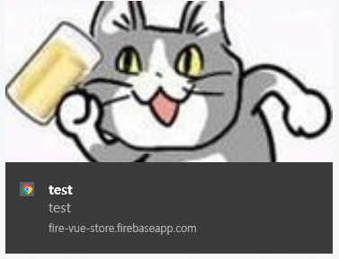
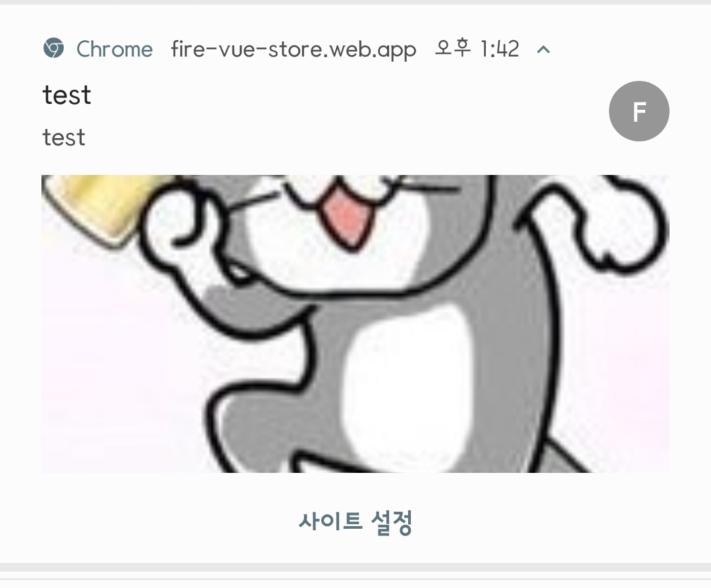

# 🔥파이어 뷰 스토어

`Vue.js` 를 사용한 프론트와 `firebase`를 사용한 백엔드로 웹앱 개발하기 전 기초 다지기

## 💻Deploy

https://fire-vue-store.web.app/

https://fire-vue-store.firebaseapp.com/

## ✔기능

- [x] Vue 이벤트 관리

- [x] 기본적인 CRUD (Review 페이지)
- [x] 뷰 라우터 (vue-router)
- [x] PWA 장착
- [x] 구글 애널리틱스 장착

- [x] 뷰와 파이어베이스 연동
- [x] 파이어베이스 데이터베이스 (firebase/firestore)
- [x] 파이어베이스 클라우드메시징 (FCM)
- [x] [파이어베이스 호스팅](https://fire-vue-store.firebaseapp.com/)

## 📸스크린샷

    
 홈 

    

    
 리뷰 

    

    
 리뷰 디테일 

    

    
 FCM (데스크탑 & 안드로이드) 
    
         
    

## 💬기타

> 파이어 스토어의 용량이 상당하다.
>
> 빌드 시에 에셋 크기가 크다고 떠서 최대한 코드 스플릿을 해보았으나, 경고가 3개에서 1개로 줄어들었을 뿐, 파이어 스토어를 가져온 파일의 크기가 커지는 것은 막을 수 없었다.

> 정말 연습용이다. 다음에 멋사 페이지에 사용할 기술 스택들을 미리 만들어보았다. ~~다시 만들 수 있을까~~

> FCM과 구글 애널리틱스 연동이 애매하다.
>
> 분명 내 데스크탑과 폰으로 알람이 오는데, 구글 애널리틱스에서는 0명에게 전달이 뜬다.
