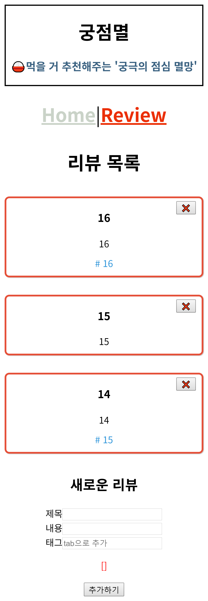
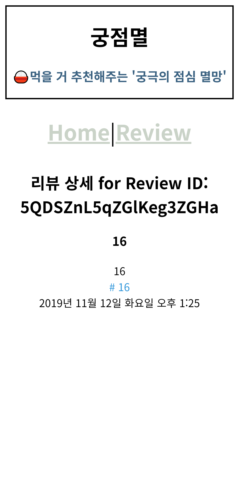

# 🔥파이어 뷰 스토어

`Vue.js` 를 사용한 프론트와 `firebase`를 사용한 백엔드로 웹앱 개발하기 전 기초 다지기

## 💻Deploy

https://fire-vue-store.web.app/

https://fire-vue-store.firebaseapp.com/

## ✔기능

- [x] Vue 이벤트 관리

- [x] 기본적인 CRUD (Review 페이지)
- [x] 뷰 라우터 (vue-router)
- [x] PWA 장착
- [x] 구글 애널리틱스 장착

- [x] 뷰와 파이어베이스 연동

- [x] 파이어베이스 데이터베이스 (firebase/firestore)
- [x] 파이어베이스 클라우드메시징 (FCM)
- [x] [파이어베이스 호스팅](https://fire-vue-store.firebaseapp.com/)

## 📸스크린샷

